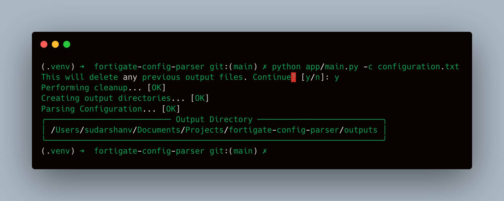

[](https://github.com/SudarshanVK/fortigate-config-parser/actions/workflows/main.yaml)
[](https://www.python.org/downloads/release/python-310/)
[](https://github.com/ambv/black)

# Fortigate Configuration Parser

A toolkit to parse Fortigate CLI configuration and generate structured data.

# Installation

If using python virtual environment,

```
git clone https://github.com/SudarshanVK/fortigate-config-parser.git
cd fortigate-config-parser
python -m venv .venv
source .venv/bin/activate
pip install -r requirements.txt
```

If using poetry,

```
git clone https://github.com/SudarshanVK/fortigate-config-parser.git
cd fortigate-config-parser
poetry install
source .venv/bin/activate
```

# Execution

The script requires the path to the configuration file as an argument.

```
python app/main.py --help
Usage: main.py [OPTIONS]

Options:
  -c, --configuration TEXT  Path to configuration file  [required]
  --help                    Show this message and exit.
```

### Sample execution output

A sample execution screenshot is as below


# Output

The toolkit outputs the parsed configuration in three formats: JSON, YAML and XLSX.
The outputs are stores in a dedicated folder in the parent directory.

Sample outputs can be found [here](./outputs)

# Authors

Sudarshan Vijaya Kumar
